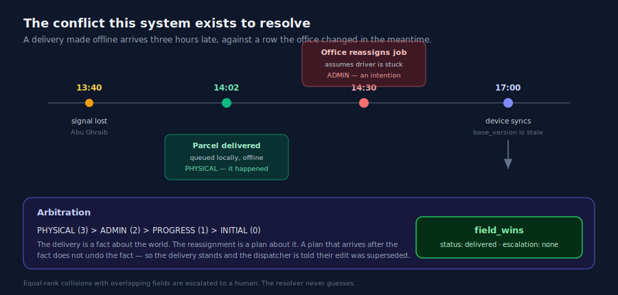
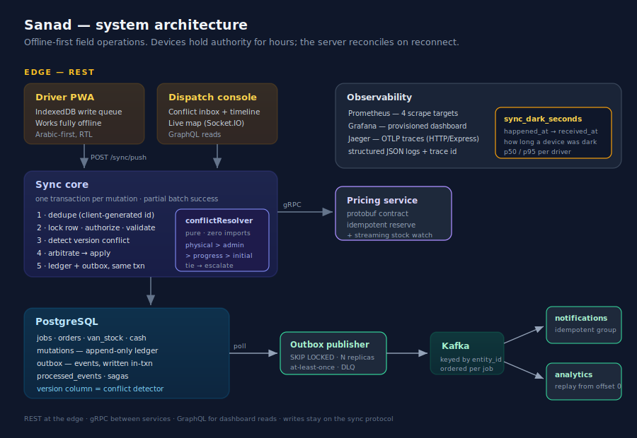

<div align="center">

# Sanad

**Offline-first field operations platform**

Delivery drivers and field salesmen work for hours with no connectivity, then reconnect.
The hard problem is not the sync — it is what happens when the field and the office disagree.

<br>


</div>

---

## What this is

A driver loses signal at 13:40. At 14:02 he hands a parcel to a customer and taps **delivered** on a phone with no connectivity. At 14:30 the office, seeing no update and assuming he is stuck, **reassigns that job to someone else**. At 17:00 he reaches signal and his delivery syncs — three hours late, against a row that changed underneath him.

Who wins?

Every naive answer is wrong. Last-write-wins hands it to the dispatcher and the system then claims a parcel sitting in a customer's kitchen is still out for delivery. Trusting device clocks builds consistency on a number any rooted phone can change. Prompting a human every time produces forty prompts on a bad day, and by the fifth nobody reads them.

Sanad's answer:

> ### Physical truth outranks administrative intent.

A delivery **happened**. A reassignment is an **intention** about what should happen. When a plan collides with a fact, the fact wins, and the office is told its plan was overtaken by reality.

<div align="center">

</div>

---

## Highlights

|                                   |                                                                                                                                                                                                                 |
| --------------------------------- | --------------------------------------------------------------------------------------------------------------------------------------------------------------------------------------------------------------- |
| **Conflict arbitration**          | Rank-based resolution (physical > admin > progress > initial) with field-level merge for disjoint edits. Ties escalate to a human — the resolver never guesses. Pure functions, zero imports, 48 tests in 0.7s. |
| **Offline-first sync protocol**   | Client-generated mutation ids, per-device sequencing, optimistic concurrency via row versions. One transaction per mutation so a single stale item cannot roll back a day of valid work.                        |
| **Outbox pattern**                | Events written to Postgres in the same transaction as the state change, relayed to Kafka by separate workers. Kafka can be down for an hour and the field never notices.                                        |
| **Exactly-once effects**          | At-least-once delivery plus idempotent consumers, deduped on `(event_id, consumer_group)` so fan-out is preserved. Poison messages dead-letter instead of blocking a partition.                                 |
| **Sagas with compensation**       | Multi-system operations (payment, logistics, SMS) with compensating actions and persisted progress, so a crash-recovery sweep compensates exactly what completed.                                               |
| **Three protocols, deliberately** | REST at the edge, gRPC between services (protobuf, streaming, deadlines), GraphQL for dashboard reads with DataLoader batching. Writes stay on the sync protocol.                                               |
| **Security**                      | Offline auth via scope-inverted tokens, BOLA closed at the query level, mass-assignment allowlist evaluated before arbitration, token-bucket rate limiting in atomic Lua, secrets scanning gated in CI.         |
| **Observability**                 | Prometheus across 4 targets, provisioned Grafana dashboard, OTLP traces to Jaeger, and `sync_dark_seconds` — the gap between when an action happened in the field and when the server heard about it.           |
| **Load tested to failure**        | Found the breaking point, diagnosed it, fixed it, re-measured. Numbers below.                                                                                                                                   |
| **115 tests, 6 layers**           | unit · contract · integration · api · chaos · load. Every layer answers a question the others cannot.                                                                                                           |

---

## Architecture

<div align="center">

</div>

The single requirement — _the device is authoritative for hours_ — forces everything else:

| The requirement forces | Because                                                  |
| ---------------------- | -------------------------------------------------------- |
| Local-first writes     | The UI cannot wait for a network that is not there       |
| Client-generated ids   | Only the device knows two uploads are the same act       |
| Idempotency            | A dropped response means the device retries              |
| Per-device sequencing  | Packets arrive in a different order than the human acted |
| Optimistic concurrency | You cannot hold a row lock across nine dark hours        |
| Conflict arbitration   | The office changed the row while the device was gone     |
| An append-only ledger  | Six months later, someone asks why a row looks like that |
| The outbox pattern     | A state change and its event must be inseparable         |

---

## Load testing: found the ceiling, then moved it

A "reconnect storm" — 300 devices returning from long offline periods simultaneously, 15% retrying the same batch to exercise idempotency under concurrency.

**First run of the harness was wrong**, and that mattered: it seeded one device session and shared it across all 300 virtual users. The rate limiter is keyed by `device_id`, so 98% of traffic was throttled. That measured the rate limiter, not the sync path. Fixed to seed one real session per device.

**Then it broke properly:**

```
sync_failed          44.66%
sync_batch_latency   p95 30s, p99 30s      (pinned at the client timeout)
http_req_failed      20.76%
iterations           ~2,000 of ~3,600
```

**Diagnosis.** 6,616 slow-query warnings on a normally sub-5ms dedupe lookup, and **zero** pg errors. That absence is the clue: every service inherited a 20-connection pool default and none set an override — five pools against Postgres's `max_connections = 100` is exactly 100, with zero headroom. And `pg`'s `connectionTimeoutMillis` bounds the initial TCP connect, not time spent waiting for a client in the pool's internal queue, so exhaustion never throws. It queues silently, latency climbs with nothing logged, clients time out, and their retries add more work on top.

**Fix.** Rebalanced pools to match actual demand: API 20 → 60, background workers 20 → 5 each. Worst case 80, leaving 20 connections of headroom.

```
sync_failed          44.66%  →  20.15%
http_req_failed      20.76%  →  10.53%
iterations           ~2,000  →  ~2,765        (+38% throughput)
```

**Still not fully resolved, honestly.** p95 remains pinned under the full 300-device storm. With connections no longer scarce, Postgres itself is the next constraint — contended row locks, WAL flushes, and lock waits across a sequential per-mutation-transaction design, on a single container on one laptop. The next lever is horizontal API replicas behind a load balancer, which is what `k8s/` already reaches for. That is a larger change than a pool tweak, and it is not done.

---

## Running it

```bash
docker compose up -d --build
curl localhost:4000/health
```

Then the scenario above, against the real engine:

```bash
curl -X POST localhost:4000/demo/scenario/conflict
```

```json
{
  "outcome": {
    "resolution": "field_wins",
    "job_status_now": "delivered",
    "explanation": "The delivery stands. The parcel is with the customer, and no
                    office edit made three hours later can un-happen that. The
                    dispatcher is notified that their reassignment was superseded."
  }
}
```

Full walkthrough with expected output at every step: **[RUNNING.md](RUNNING.md)**

### Deploying

```bash
docker compose -f docker-compose.yml -f docker-compose.prod.yml up -d
```

The overlay closes every port except Caddy's, gets automatic TLS via
Let's Encrypt, serves both PWAs, and exposes Grafana and Jaeger publicly
(Grafana read-only, via an anonymous Viewer role) alongside Prometheus for
this demo. Full guide: **[deploy/DEPLOY.md](deploy/DEPLOY.md)**

---

## Documentation

| Document                                                | Contents                                                                                                                |
| ------------------------------------------------------- | ----------------------------------------------------------------------------------------------------------------------- |
| [`ARCHITECTURE.md`](docs/ARCHITECTURE.md)               | Layering, module boundaries, dependency injection, why the composition root exists                                      |
| [`CONFLICT_RESOLUTION.md`](docs/CONFLICT_RESOLUTION.md) | The rank system, merge rules, escalation policy, and the ordering bug that produced a job both delivered and reassigned |
| [`SYNC_PROTOCOL.md`](docs/SYNC_PROTOCOL.md)             | Wire format, the four fields that carry the design, the nine-step pipeline                                              |
| [`API_DESIGN.md`](docs/API_DESIGN.md)                   | REST vs gRPC vs GraphQL, and where each does not belong                                                                 |
| [`SECURITY.md`](docs/SECURITY.md)                       | Threat model, offline auth, BOLA, mass assignment, why check ordering is a security property                            |
| [`KAFKA.md`](docs/KAFKA.md)                             | Topics, partition keys, consumer groups, the outbox pattern, at-least-once semantics                                    |
| [`REDIS.md`](docs/REDIS.md)                             | Rate limiting across replicas, the atomic Lua script, the Socket.IO adapter                                             |
| [`TESTING.md`](docs/TESTING.md)                         | Six layers and what each one proves that the others cannot                                                              |
| [`TEST_RESULTS.md`](TEST_RESULTS.md)                    | Full suite output, load test numbers, and every bug found by running it end to end                                      |
| [`SCHEMA.md`](docs/SCHEMA.md)                           | Tables, indexes, and the columns that carry the design                                                                  |
| [`AWS.md`](docs/AWS.md)                                 | Terraform design, spot workers, IRSA, and an honest critique of the bill                                                |
| [`RUNBOOK.md`](docs/RUNBOOK.md)                         | Operational procedures and failure playbooks                                                                            |
| [`deploy/DEPLOY.md`](deploy/DEPLOY.md)                   | Server preparation, DNS, TLS, secrets, and day-to-day operation                                                         |

---

## Stack

**Runtime** Node 20, Express, PostgreSQL 16, Redis 7, Kafka 3.7
**Interfaces** REST, gRPC (`@grpc/grpc-js` + protobuf), GraphQL (Apollo + DataLoader), Socket.IO
**Testing** Jest, Testcontainers, supertest, Pact, k6
**Infrastructure** Docker (multi-stage), Kubernetes (HPA on a leading metric), GitHub Actions with gated canary deploy, Terraform
**Observability** Prometheus, Grafana, OpenTelemetry, Jaeger, pino

---

## Known limitations

- **AWS Terraform is designed, not applied.**
- **No mTLS between services.**
- **Load ceiling is single-instance.** Postgres and the API run as one container each on one machine. Horizontal scaling is configured in `k8s/` but has not been exercised under load.

---

<div align="center">
<sub>Built as a study in offline-first distributed systems. Baghdad, 2026.</sub>
</div>
